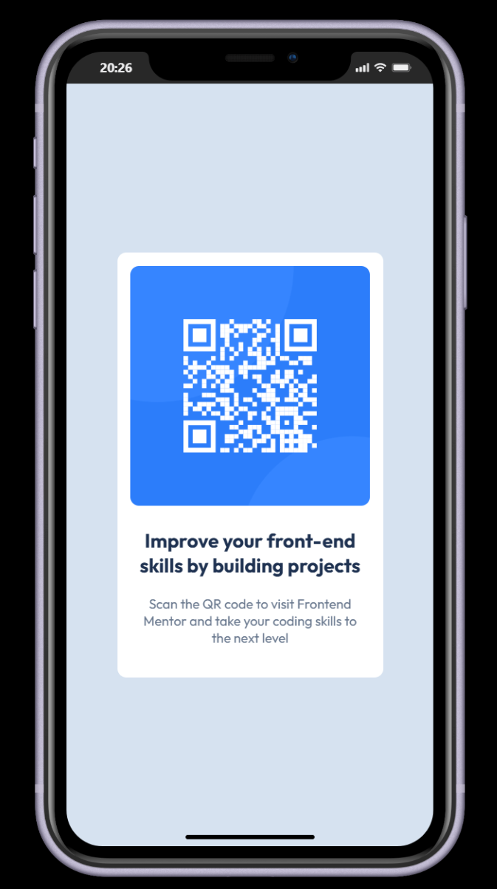

# Frontend Mentor - QR code component solution
This is my solution to the [QR code component challenge on Frontend Mentor](https://www.frontendmentor.io/challenges/qr-code-component-iux_sIO_H). 
## Table of contents
  - [Screenshot](#screenshot)
  - [Links](#links)
- [Built with](#built-with)
- [Author](#author)

### Screenshot
Desktop view:

Mobile view:

### Links
- Solution URL: https://github.com/DannyTamayo2003/frontend-mentor-qr-code-component

### Built with
- Semantic HTML5 markup
- CSS
- Flexbox

## Author
GitHub - https://github.com/DannyTamayo2003
Frontend Mentor - [@DannyTamayo2003](https://www.frontendmentor.io/profile/DannyTamayo2003)

